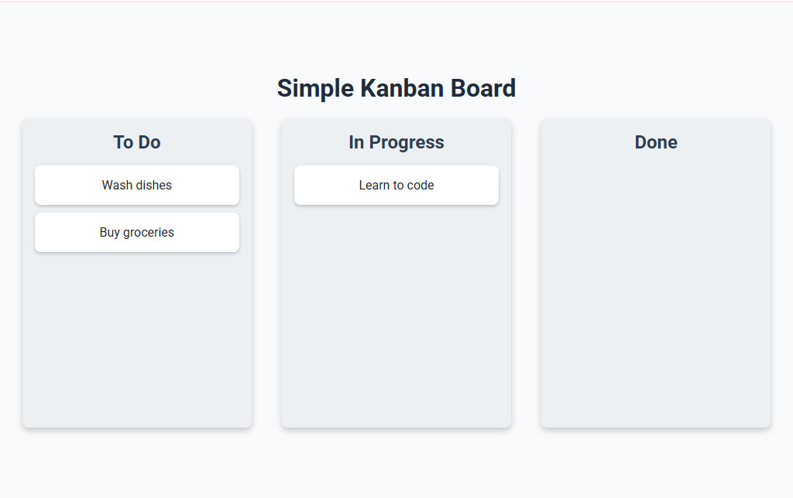

# 📝 Simple Kanban Board

A minimal **Kanban Board** built with **HTML, CSS, and JavaScript**.  
This project demonstrates how to use the **Drag and Drop API** to move task cards between lists (To Do, In Progress, Done).  

---

## 🚀 Live Page
[🔗 View the Live Demo](https://laibatariq110.github.io/kanban-board/)

---

## 📸 Screenshots  

### Kanban Board – Initial View  


### Dragging a Task  


### After Dropping a Task  


---

## 🎯 Features
- Three lists: **To Do**, **In Progress**, and **Done**  
- Cards can be dragged and dropped between lists  
- Smooth UI with shadows and hover effects  
- Responsive design for smaller screens  
- Uses **Drag and Drop API** for handling tasks  

---

## 🛠️ Technologies Used
- **HTML5** – Structure  
- **CSS3** – Styling with HSL colors & responsiveness  
- **JavaScript (ES6)** – Drag & Drop functionality  

---

## 📂 Project Structure
/project-root
│── index.html
│── style.css
│── script.js
│── ss1.png
│── ss2.png
│── ss3.png
│── README.md

## 📌 How to Use
1. Clone the repository:  
   ```bash
   git clone https://github.com/laibatariq110/kanban-board.git
2. Open index.html in your browser.
3. Drag and drop tasks between the lists!

## 🎯 Future Improvements

- Add a form to create new tasks.

- Support for deleting tasks.

- Save tasks to local storage.

## License

This project is licensed under the MIT License – feel free to use and modify it as you like.
